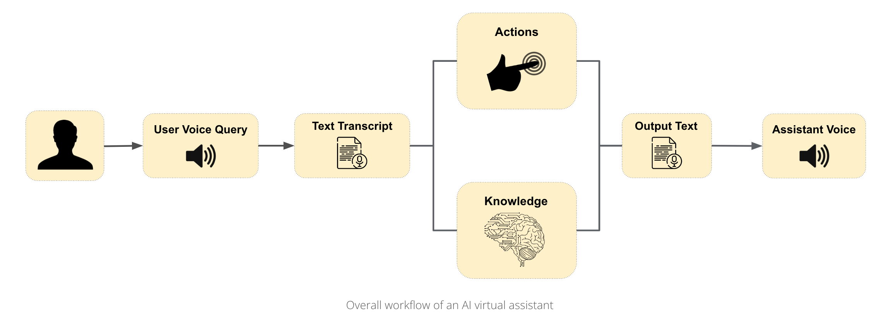

# AI and Robotics Virtual Assistant


<br>

# Table of Contents
[1. Project Description](#project-description)<br>
[2. Project Goals](#project-goals)<br>
[3. Reading Resources](#reading-resources)<br>
[4. Development Setup](#development-setup)<br>
[5. Contributing](#contributing)<br>

## Project Description

Imagine having a digital assistant that can chat with you like a real person, providing you with instant and relevant information whenever you need it. That's the power of an AI virtual assistant and our vision is inspired by J.A.R.V.I.S (Iron Man's AI assistant). We want to create a virtual assistant that can help you with your day-to-day tasks, such as finding information on the web, scheduling meetings, and more.

The overall workflow of a virtual assistant starts with voice or text interaction. If the input was voice, it is converted into text and then use that text to find the intent of the user. Once we have the intent, we can use it to find the relevant information and respond back to the user. The response can be in the form of text or voice, depending on the user's preference.




## Project Goals

- Create a virtual assistant that can chat with you like a real person
- Provide instant and relevant information whenever you need it
- Help you with your day-to-day tasks, such as finding information on the web, scheduling meetings, and more


## Reading Resources

If you've never heard about prompt engineering, Chain of Thought (CoT), Retrieval Augmented Generation (RAG), or ReAct, it is recommended to learn the basics from the following list of resources:

- [Prompt Engineering Guide](https://www.promptingguide.ai/)
  - [Chain of Thought (CoT)](https://arxiv.org/abs/2201.11903)
  - [Retrieval Augmented Generation (RAG)](https://gpt-index.readthedocs.io/en/latest/getting_started/concepts.html)
  - [ReAct](https://arxiv.org/abs/2210.03629)
- *Extra Reading:* [The Rise and Potential of Large Language Model
Based Agents: A Survey](https://arxiv.org/pdf/2309.07864.pdf)

After reading all of these resources, you will have all of the theoretical knowledge required to design an LLM-powered virtual assistant! Now it is coding time 🎉🎉


## Development Setup

1. Create a `.env` file with your Azure API credentials

2. Create and activate a virtual environment
```bash
python3 -m venv venv && . venv/bin/activate
```

3. Install dependencies
```bash
pip install -r requirements.txt
```


## Contributing

Follow the steps in `CONTRIBUTING.md` to contribute to this project.
